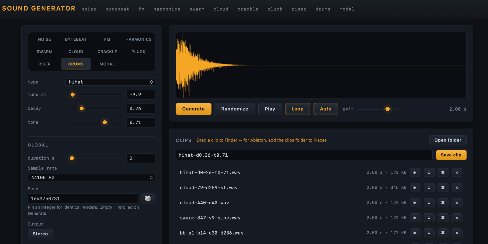

# Sound Generator

Two approaches to generating sound files from raw data in pure Python — no DAW, no plugins, just code and math.



**Requires [uv](https://docs.astral.sh/uv/).** Every command below is run through `uv run`, which resolves Python (3.13+), installs all dependencies, and puts the project's `generate` and `databend` commands on the path automatically — no manual installs, no virtualenvs to manage. Install uv once and everything works.

---

## Web UI — quick start

A local web frontend for the synthesis engine — tweak parameters with sliders, pre-listen instantly, and collect clips for your DAW. The frontend is plain HTML/JS served by the backend — one command starts both, no build step:

```bash
# from the repo root
uv run uvicorn ui.server:app --port 8765
```

Then open **http://localhost:8765** in your browser. Stop the server with `Ctrl+C`.

Alternatives:

```bash
# without uvicorn on the command line (same server, fixed port 8765)
uv run python ui/server.py

# development — auto-restart when ui/server.py changes
uv run uvicorn ui.server:app --port 8765 --reload

# different port
uv run uvicorn ui.server:app --port 9000
```

Saved clips land in `clips/` at the repo root (created on first save, gitignored).

- **Modes** — Noise / Bytebeat / FM / Harmonics / Swarm / Cloud / Crackle / Pluck / Riser / Drums / Modal / Databend tabs expose every CLI parameter as a slider (hover any control for an explanation), plus the ADSR envelope, the effects chain (drive / wavefolder / bitcrusher / resonant filter), a stereo toggle, and a global seed control (pin a seed for reproducible textures; unpinned renders reroll on Generate and the saved clip always matches the last preview).
- **Databend tab** — [databending](#approach-2--databending-databend) from the browser: sonify the bundled demo image (Claude Monet, *Water Lilies*, 1906 — public domain) or upload/drag-drop any file (16 MB max, held in server memory). All three bend modes are available — audify, scale, and granular — with the duration slider acting as the length cap and the seed driving granular's grain noise. Output is mono; the effects chain, envelope, and clip library work as on every other tab.
- **Pre-listen** — clips render on the fly (auto-rerender as you drag sliders) and play in the browser with loop and gain control; the waveform is drawn on a canvas. A **Randomize** button rolls a fresh patch: random values for the current mode's parameters and the effects chain (frequencies drawn log-uniform, effects kept tasteful), leaving the envelope, duration, and output settings untouched.
- **Clip library** — save named takes to the `clips/` folder, with per-clip download, reveal-in-Finder, and delete. Dragging a clip out of the browser works onto Finder/Desktop (Chrome delivers it as a file promise). **Ableton ignores browser drags** — it only accepts real file paths — so add the `clips/` folder to Live's browser sidebar once (**Places → Add Folder…**): every saved clip then appears directly in Ableton with native preview and drag. Or use the per-clip reveal button and drag from Finder.

---

## Approaches

| Approach | Command | Input | Character |
|---|---|---|---|
| [**Algorithmic generation**](#approach-1--algorithmic-generation-generate) | `generate` | Nothing — sound is synthesised from formulas | Bytebeat patterns, white noise |
| [**Databending**](#approach-2--databending-databend) | `databend` | Any binary file (image, executable, document…) | Glitch music, soundscapes, melodic textures |

---

## Approach 1 — Algorithmic Generation (`generate`)

Sound is generated entirely from mathematical formulas operating on a sample counter. No input file needed.

### Usage

```bash
uv run generate <duration> [options]
```

### Arguments

| Argument | Description |
|---|---|
| `duration` | Length of audio in seconds |
| `--output` | Output filename (default: `output.wav`) |
| `--sample-rate` | Sample rate in Hz (default: `44100`) |
| `--random` | Use random noise (default mode) |
| `--bytebeat` | Use bytebeat algorithm |
| `--fm` | Use FM synthesis |
| `--harmonics` | Use layered harmonics |
| `--swarm` | Use detuned drone swarm |
| `--graincloud` | Use granular cloud |
| `--crackle` | Use crackle/dust impulses |
| `--pluck` | Use Karplus-Strong plucks |
| `--riser` | Use riser/transition FX |
| `--drum` | Use drum one-shot |
| `--modal` | Use modal struck resonator |
| `--stereo` | Render stereo output (any mode) |
| `--seed` | RNG seed — makes any stochastic mode reproducible |

### Modes

#### Random (noise)

Random noise in three colors, selected with `--noise-color`. Pass `--seed` to make the output reproducible.

| Color | Spectrum | Character |
|---|---|---|
| `white` (default) | Flat | Bright, hissy — all frequencies at equal energy |
| `pink` | 1/f | Balanced, organic — equal energy per octave |
| `brown` | 1/f² | Deep, rumbling — like distant surf |

```bash
uv run generate 5
uv run generate 5 --noise-color pink --output pink.wav
uv run generate 5 --noise-color brown --seed 42
```

#### Bytebeat

Bytebeat is a technique where simple integer arithmetic on a sample counter `t` produces structured, lo-fi, algorithmically musical output. Classic bytebeat runs at an 8000 Hz tick rate — the script scales `t` automatically so pitch stays consistent regardless of `--sample-rate`.

```bash
uv run generate 5 --bytebeat
uv run generate 5 --bytebeat --output my_sound.wav
```

##### Formula

```
(t & (t >> a) | (t // b) ^ (t >> c) & d) & 0xFF
```

where `t` is the 8000 Hz tick counter and `a`, `b`, `c`, `d` are tunable parameters.

##### Bytebeat Parameters

| Flag | Default | Role | Low values | High values |
|---|---|---|---|---|
| `--bb-a` | `8` | Primary right-shift | Dense, buzzy | Slower rhythm, more structure |
| `--bb-b` | `5` | Integer divisor | Fast texture | Slower sub-pattern |
| `--bb-c` | `3` | Secondary right-shift | Harsh harmonics | Smoother mix |
| `--bb-d` | `128` | AND/XOR mask (0–255) | Sparse, glitchy | Full texture |

##### Presets

```bash
# Rhythmic
uv run generate 5 --bytebeat --bb-a 6 --bb-b 7 --bb-c 4 --bb-d 255

# Metallic
uv run generate 5 --bytebeat --bb-a 10 --bb-b 2 --bb-c 6 --bb-d 64

# Lo-fi melody
uv run generate 5 --bytebeat --bb-a 8 --bb-b 11 --bb-c 2 --bb-d 192
```

#### FM synthesis

A carrier sine wave is phase-modulated by a second oscillator running at `carrier × ratio` Hz. Integer ratios produce harmonic, bell-like tones; non-integer ratios produce inharmonic, metallic ones. The modulation index controls brightness — `0` is a pure sine, higher values add ever more sidebands.

```bash
uv run generate 5 --fm
uv run generate 5 --fm --fm-freq 110 --fm-ratio 1.5 --fm-index 3
```

##### FM Parameters

| Flag | Default | Role | Low values | High values |
|---|---|---|---|---|
| `--fm-freq` | `220` | Carrier frequency (Hz) | Deep, bassy | High, piercing |
| `--fm-ratio` | `2.0` | Modulator/carrier ratio | Smooth, harmonic | Clangorous, inharmonic |
| `--fm-index` | `5.0` | Modulation depth | Pure, sine-like | Bright, noisy |

##### Presets

```bash
# Bell — inharmonic ratio + decaying envelope
uv run generate 3 --fm --fm-freq 440 --fm-ratio 3.5 --fm-index 8 --attack 0.005 --decay 2.5 --sustain 0

# Metallic drone
uv run generate 5 --fm --fm-freq 110 --fm-ratio 2.37 --fm-index 12

# Soft FM bass
uv run generate 5 --fm --fm-freq 55 --fm-ratio 1 --fm-index 2
```

#### Layered harmonics

Stacks sine waves at integer multiples of a base frequency with amplitudes falling off as `1/n^decay`, normalised so the sum never clips. Partials above the Nyquist frequency are skipped automatically. `--harm-decay 1.0` matches a sawtooth's rolloff; higher values sound darker and rounder.

```bash
uv run generate 5 --harmonics
uv run generate 5 --harmonics --harm-freq 220 --harm-count 12
```

##### Harmonics Parameters

| Flag | Default | Role | Low values | High values |
|---|---|---|---|---|
| `--harm-freq` | `110` | Base frequency (Hz) | Deep, bassy | High, thin |
| `--harm-count` | `8` | Number of harmonics | Pure, flute-like | Rich, buzzy |
| `--harm-decay` | `1.0` | Amplitude rolloff exponent | Bright, saw-like | Dark, round |
| `--harm-stretch` | `0` | Inharmonicity (piano-string stretch) | Perfectly harmonic | Bell-like, detuned partials |
| `--harm-odd` | off | Odd partials only (flag) | — | Hollow, clarinet-like |
| `--harm-drift` | `0` | Slow per-partial amplitude LFO depth | Static tone | Evolving, breathing drone |

##### Presets

```bash
# Organ-ish — slow rolloff, medium stack
uv run generate 5 --harmonics --harm-freq 110 --harm-count 6 --harm-decay 0.5

# Saw-like buzz — many harmonics, 1/n rolloff
uv run generate 5 --harmonics --harm-freq 82.4 --harm-count 16 --harm-decay 1.0

# Dark hum — steep rolloff
uv run generate 5 --harmonics --harm-freq 55 --harm-count 8 --harm-decay 2.0

# Evolving spectral drone — inharmonic partials, slow shimmer (great for granulation)
uv run generate 20 --harmonics --harm-freq 82.4 --harm-count 16 --harm-stretch 0.008 --harm-drift 0.7 --stereo --seed 42
```

### Texture Generators

Five stochastic generators built as chop/granulation fodder for a DAW. All are seedable (`--seed`) and stereo-capable (`--stereo`).

#### Drone swarm

Many detuned copies of a basic waveform, spread across the stereo field, with a slow random pitch wander per voice. Thick, beating, evolving — the classic granulation source.

| Flag | Default | Role | Low values | High values |
|---|---|---|---|---|
| `--swarm-freq` | `110` | Base frequency (Hz) | Deep drone | Screaming lead |
| `--swarm-voices` | `7` | Oscillator voices (1–16) | Thin, focused | Massive, dense |
| `--swarm-wave` | `saw` | Waveform: saw, sine, square, triangle | — | — |
| `--swarm-detune` | `25` | Detune spread (cents) | Gentle chorus | Dissonant cluster |
| `--swarm-drift` | `0.2` | Pitch-wander depth 0–1 | Static beating | Seasick, evolving |

```bash
# Classic supersaw pad
uv run generate 15 --swarm --swarm-voices 9 --swarm-detune 30 --stereo

# Deep sine drone, slow drift
uv run generate 30 --swarm --swarm-freq 55 --swarm-wave sine --swarm-voices 5 --swarm-drift 0.6 --stereo
```

#### Grain cloud

Stochastic micro-grains (Hanning-windowed sine bursts, or noise) scattered in time and pitch. Shimmering, spacious clouds — density and spread are the big handles.

| Flag | Default | Role | Low values | High values |
|---|---|---|---|---|
| `--gc-density` | `40` | Grains per second | Sparse droplets | Dense wash |
| `--gc-grain-ms` | `60` | Grain length (ms) | Clicky, granular | Smooth, pad-like |
| `--gc-pitch` | `440` | Centre pitch (Hz) | Dark cloud | Glassy sparkle |
| `--gc-spread` | `12` | Pitch spread (± semitones) | Tonal, focused | Wide, atonal |
| `--gc-source` | `sine` | Grain material: sine or noise | — | — |

```bash
# Shimmering tonal cloud
uv run generate 20 --graincloud --gc-pitch 880 --gc-spread 7 --gc-density 60 --stereo

# Airy noise wash
uv run generate 15 --graincloud --gc-source noise --gc-grain-ms 120 --gc-density 80 --stereo
```

#### Crackle / dust

Sparse random impulses with short resonant tails — squared-uniform amplitudes give many quiet ticks and a few loud pops. Vinyl crackle at low density, Geiger-counter dust at high density. Excellent rhythmic chop material.

| Flag | Default | Role | Low values | High values |
|---|---|---|---|---|
| `--ck-density` | `30` | Events per second | Lonely pops | Frying-pan sizzle |
| `--ck-tone` | `2500` | Centre resonance (Hz) | Woody knocks | Glassy ticks |
| `--ck-decay-ms` | `6` | Tail time-constant (ms) | Dry clicks | Ringing pings |

```bash
# Vinyl surface noise
uv run generate 20 --crackle --ck-density 12 --ck-tone 1800 --stereo

# Dense metallic dust
uv run generate 10 --crackle --ck-density 300 --ck-tone 5000 --ck-decay-ms 15 --stereo
```

#### Karplus-Strong plucks

Physically-modelled plucked strings (two delay lines, re-excited on a clock). Organic, woody attacks that granulate beautifully. In stereo the two strings sit left/right for a ping-pong feel.

| Flag | Default | Role | Low values | High values |
|---|---|---|---|---|
| `--pk-freq` | `220` | String frequency (Hz, 20–2000) | Bassy thumps | Harp-like plinks |
| `--pk-decay` | `0.6` | Ring length 0–1 | Muted, dampened | Endless sustain |
| `--pk-interval` | `0.5` | Seconds between plucks (0 = single) | Fast strumming | Meditative pulses |

```bash
# Slow meditative plucks
uv run generate 20 --pluck --pk-freq 110 --pk-decay 0.9 --pk-interval 1.5 --stereo

# Fast koto-like strum
uv run generate 10 --pluck --pk-freq 440 --pk-decay 0.4 --pk-interval 0.12 --stereo
```

#### Riser / transition FX

Pitch, brightness, and volume ramp together over the clip: detuned saws sweep upward while a noise layer crossfades from dark pink to bright white. `--rs-direction down` mirrors everything into a downlifter. Arrangement glue — risers into drops, falling exits out of them.

| Flag | Default | Role | Low values | High values |
|---|---|---|---|---|
| `--rs-freq` | `110` | Start pitch (Hz) | Sub rumble rise | Screaming top |
| `--rs-octaves` | `2.0` | Pitch-sweep span (octaves) | Subtle lift | Rocket launch |
| `--rs-voices` | `3` | Detuned saw voices (1–8) | Clean sweep | Thick ensemble |
| `--rs-detune` | `18` | Voice spread (cents) | Focused | Beating cluster |
| `--rs-noise` | `0.5` | Noise mix 0–1 | Pure swept tone | Pure noise crescendo |
| `--rs-curve` | `2.0` | Volume-ramp exponent | Linear swell | Explosive finish |
| `--rs-direction` | `up` | `up` = riser, `down` = downlifter | — | — |

```bash
# Classic 8-second noise riser
uv run generate 8 --riser --rs-noise 0.9 --rs-curve 3 --stereo

# Tonal supersaw rise into a drop
uv run generate 4 --riser --rs-noise 0.2 --rs-voices 6 --rs-octaves 3 --stereo --seed 7

# Downlifter — falling, fading exit
uv run generate 4 --riser --rs-direction down --stereo
```

### Percussion & Hits

One-shots and struck resonances, built for Simpler and Drum Racks. Both are seedable; in stereo, drums duplicate the centred hit while modal spreads its partials across the field.

#### Drum one-shots

Four synthesized recipes selected with `--dr-type`: kick (pitch-swept sine + click), snare (two drum modes + bright noise), hihat (six-square inharmonic cluster — deterministic, no seed), and an 808-style sub. One hit lands at t=0; shorter hits are padded with silence, so `uv run generate 1 --drum` always gives a clean one-second file.

| Flag | Default | Role | Low values | High values |
|---|---|---|---|---|
| `--dr-type` | `kick` | kick, snare, hihat, sub | — | — |
| `--dr-tune` | `0` | Pitch offset (± semitones) | Deeper | Higher |
| `--dr-decay` | `0.5` | Tail length 0–1 | Tight, dry | Boomy / open |
| `--dr-tone` | `0.5` | Brightness 0–1 | Dark, soft | Clicky, sizzly, driven |

```bash
# Tight punchy kick
uv run generate 1 --drum --dr-type kick --dr-decay 0.3 --dr-tone 0.7

# 808-style sub with long ring
uv run generate 2 --drum --dr-type sub --dr-decay 0.9 --dr-tune -2

# Open hat
uv run generate 1 --drum --dr-type hihat --dr-decay 0.8 --dr-tone 0.6

# Snappy snare
uv run generate 1 --drum --dr-type snare --dr-tone 0.8 --seed 3
```

#### Modal resonator

A bank of decaying two-pole resonators tuned to a material's mode table, struck by short noise bursts — mallet, bell, and bowl hits that granulate beautifully. `--md-interval` re-strikes on a clock (like pluck's strum).

| Flag | Default | Role | Low values | High values |
|---|---|---|---|---|
| `--md-freq` | `220` | Fundamental (Hz) | Gong-like | Glassy chimes |
| `--md-material` | `bell` | bar, bell, bowl, wood | — | — |
| `--md-decay` | `0.6` | Ring time 0–1 | Damped tick | Minute-long ring |
| `--md-brightness` | `0.75` | High-mode weighting 0–1 | Fundamental only | Full spectrum |
| `--md-interval` | `0` | Seconds between strikes (0 = single) | Single hit | Meditative pulses |

| Material | Character |
|---|---|
| `bar` | Struck metal bar — vibraphone / glockenspiel family |
| `bell` | Church bell — Risset partials (hum, prime, tierce…) |
| `bowl` | Singing bowl — longest, purest ring |
| `wood` | Woodblock — few modes, heavily damped, clave-like |

```bash
# Singing bowl drone — strike every 2 s
uv run generate 12 --modal --md-material bowl --md-interval 2 --md-decay 0.9 --stereo --seed 5

# Woodblock clave
uv run generate 1 --modal --md-material wood --md-freq 800 --md-decay 0.3

# Church bell
uv run generate 6 --modal --md-material bell --md-freq 110 --md-decay 0.8 --stereo
```

### ADSR Envelope

An attack/decay/sustain/release amplitude envelope can be applied on top of **any** mode. The defaults are a no-op, so envelope-free invocations are unchanged. If attack + decay + release exceed the clip duration, the segments are scaled proportionally to fit.

| Flag | Default | Meaning |
|---|---|---|
| `--attack` | `0` | Fade-in time (seconds), 0 → 1 |
| `--decay` | `0` | Time (seconds) to fall from 1 to the sustain level |
| `--sustain` | `1.0` | Hold level (0–1) |
| `--release` | `0` | Fade-out time (seconds), sustain → 0 |

```bash
# Percussive pluck out of a harmonics stack
uv run generate 2 --harmonics --attack 0.005 --decay 0.4 --sustain 0.2 --release 1.0

# Slow noise swell
uv run generate 6 --noise-color pink --attack 3 --release 3
```

### Effects Chain

An effects chain applied to **any** mode, before the ADSR envelope (so fades stay clean for chopping). Signal order: drive → wavefolder → rate crush → bit crush → resonant filter — the filter runs last so it can tame and animate the harmonics the distortions add. All defaults are exact no-ops.

| Flag | Default | Effect | Character |
|---|---|---|---|
| `--drive` | `0` | tanh soft-clip saturation, 0–1 | Warm thickening → aggressive fuzz |
| `--fold` | `0` | West-Coast wavefolder, 0–4 | Simple tones → complex buzzing spectra |
| `--crush-bits` | `16` | Bit-depth reduction, 1–16 (16 = off) | Lo-fi grit below 8 bits |
| `--crush-rate` | `0` | Sample-hold rate in Hz (0 = off) | Aliased, robotic downsampling |
| `--filter` | `off` | Resonant filter: lowpass, bandpass, highpass | Subtractive shaping, sweeps |
| `--cutoff` | `1000` | Filter cutoff in Hz (sweep start) | Dark → bright |
| `--resonance` | `0.707` | Filter Q, 0.5–20 | Flat → ringing, acid |
| `--cutoff-end` | `0` | Sweep target in Hz (0 = static) | Cutoff glides over the clip |

```bash
# Folded FM — bell tone into buzzing metal
uv run generate 5 --fm --fm-ratio 3.5 --fold 2.5

# Saturated swarm with lo-fi crush
uv run generate 10 --swarm --drive 0.5 --crush-bits 8 --crush-rate 11025 --stereo

# Acid sweep — crushed swarm through a screaming lowpass ramp
uv run generate 8 --swarm --crush-bits 10 --filter lowpass --cutoff 200 --cutoff-end 4000 --resonance 8 --stereo
```

### Stereo

`--stereo` renders two channels for any mode: texture generators decorrelate naturally (per-voice/per-event panning), noise uses independent channels, harmonics decorrelates partial phases, FM detunes the right channel +6 cents, and bytebeat duplicates its mono signal. Risers pan their saw voices and decorrelate the noise layer, modal gives each partial a static pan across the field, and drums duplicate the centred mono hit. With a pinned `--seed`, the mono and stereo renders of a texture share the same events — toggling width never changes the performance.

---

## Approach 2 — Databending (`databend`)

> Convert any binary file into audio — glitch music, soundscapes, and melodic textures from raw data.

### What is databending?

**Databending** is the art of feeding a non-audio file — an image, an executable, a Word document, anything — into an audio engine as if it were sound. The file's binary content becomes the waveform. The results range from harsh electronic noise to structured melodies to dense granular drones, depending on the technique used.

This script implements three distinct databending modes in pure Python, producing standard WAV files compatible with any DAW (Ableton, Logic, Reaper, etc.). All three are also available interactively in the [web UI](#web-ui--quick-start)'s **Databend** tab.

### Background

This technique sits at the intersection of several named practices:

| Term | Meaning |
|---|---|
| **Databending** | Manipulating a file using software designed for a different format. Derived from *circuit bending* — short-circuiting toys and instruments for unpredictable sounds. |
| **Audification** | The purest form: shifting a raw data stream directly into the audible realm by treating it as PCM audio samples. |
| **Data Sonification** | The broader practice of mapping any data to sound parameters — pitch, amplitude, grain density, etc. The sonic equivalent of data visualisation. |
| **Parameter-mapped sonification** | Data values mapped to musical parameters (pitch, amplitude, scale) to produce more structured, musical results. |
| **Granular sonification** | Data values used to control the amplitude of noise grains — producing textural soundscapes reminiscent of granular synthesis. |

#### Artistic tradition

Databending is firmly rooted in **glitch music**. Pioneering practitioners include:

- **stAllio!** — built entire albums from sonified image files, executables, and DLLs. Coined the term *IDM (Interpreted Data Music)* and released the landmark all-databending EP *Dissonance is Bliss* in 1999.
- **Alva Noto** — prominent use of the sonification technique in glitch and minimal electronic music.
- **r2blend** — the 2011 YouTube video *"MS Paint Interpreted as audio data = Awesome music!"* went viral and introduced the technique to a new generation.

### Requirements

Requires [uv](https://docs.astral.sh/uv/) and Python 3.13+. Dependencies come from the project, so there is nothing to install:

```bash
uv run databend --help
```

### Modes

#### `audify` — Raw bytes as a PCM waveform

The purest databending technique. Raw bytes are interpreted directly as little-endian float32 PCM samples — the file's binary content *is* the audio waveform. Produces harsh, glitchy, electronic textures. Ideal for drum one-shots, noise sources, and abstract sound design.

**Key insight:** The `--sample-rate` parameter is a powerful creative handle:
- Lower sample rate → sound is slower and lower in pitch (darker, heavier)
- Higher sample rate → sound is faster and higher in pitch (brighter, shorter)

```bash
# Default — full fidelity
uv run databend audify myimage.png output.wav

# Half sample rate — one octave lower, twice as long
uv run databend audify myfile.exe output.wav --sample-rate 22050

# Limit to first 8 KB — useful for huge files
uv run databend audify mybinary output.wav --max-bytes 8192
```

**Best source files:** Uncompressed images (BMP, TIFF) have dense, structured byte patterns and tend to sound rich. Executables (`.exe`, `.so`, `.dylib`) produce complex electronic textures. Avoid compressed files (ZIP, MP3) — the entropy is too uniform.

#### `scale` — Bytes mapped to musical pitches

Each byte value (0–255) is mapped to a pitch in a musical scale across 5 octaves, synthesised as a sine tone with a BPM-quantised duration. Byte value also modulates amplitude — louder notes correspond to higher byte values. Produces actual melodies and harmonic patterns directly from the data.

**Available scales:**

| Scale | Character |
|---|---|
| `pentatonic` | Open, universal, rarely clashes — good default |
| `blues` | Gritty, expressive, works well with glitchy textures |
| `phrygian` | Dark, modal, Middle Eastern flavour |
| `minor` | Melancholic, familiar |
| `major` | Bright, resolving |
| `lydian` | Dreamy, floating |
| `wholetone` | Ambiguous, impressionistic |
| `chromatic` | All 12 pitches — atonal, dense |

```bash
# Phrygian mode at 140 BPM, 16th notes (default)
uv run databend scale myfile.docx output.wav --scale phrygian --bpm 140

# Blues at 90 BPM, 32nd notes — very fast melodic runs
uv run databend scale myimage.png output.wav --scale blues --bpm 90 --divisions 8

# Slow, quarter-note pentatonic — spacious and meditative
uv run databend scale mybinary output.wav --scale pentatonic --bpm 60 --divisions 1

# Limit to 256 bytes — produces a concise 256-note phrase
uv run databend scale myfile.png output.wav --max-bytes 256
```

> **Note:** Scale mode default `--max-bytes 512` keeps output to a manageable length. A 10 KB file at 120 BPM, 16th notes would produce ~85 seconds of audio.

#### `granular` — Bytes as noise-grain amplitudes

Bytes are grouped into grains. Each grain's byte values modulate the amplitude of a Hanning-windowed white noise burst, producing dense textural soundscapes. This is conceptually identical to granular synthesis — but with file data as the control signal instead of a human performer.

**Parameters:**
- `--grain-ms` — grain duration. Short (5–20 ms) = granular buzz and crunch. Long (50–200 ms) = smoother evolving washes.
- `--density` — overlap factor. 1.0 = adjacent grains (no overlap). 4.0+ = dense, reverberant wash.

```bash
# Default — 20 ms grains, 2× overlap
uv run databend granular myfile.docx output.wav

# Long grains, high density — ambient drone/pad
uv run databend granular myfile.png output.wav --grain-ms 80 --density 4

# Short grains, low density — percussive, chattery texture
uv run databend granular myfile.exe output.wav --grain-ms 8 --density 1.2
```

### All options

```
usage: databend {audify,scale,granular} input output [options]

AUDIFY:
  --sample-rate INT    Sample rate in Hz (default 44100)
  --max-bytes INT      Limit input to first N bytes

SCALE:
  --scale NAME         Musical scale: pentatonic (default), blues, phrygian,
                       minor, major, lydian, wholetone, chromatic
  --bpm FLOAT          Tempo in BPM (default 120)
  --divisions INT      Note grid: 1=quarter, 2=8th, 4=16th (default), 8=32nd
  --max-bytes INT      Limit input bytes (default 512)

GRANULAR:
  --grain-ms FLOAT     Grain duration in milliseconds (default 20)
  --density FLOAT      Overlap factor (default 2.0)
  --max-bytes INT      Limit input to first N bytes
```

### Ableton Live workflow

The output WAVs are standard 16-bit / 44.1 kHz and drop straight into Ableton.

**Suggested routing:**

1. **`audify` → Simpler**
   Drop the WAV into Simpler. Use it as a one-shot sample. Pitch it down with the transpose knob, apply a low-pass filter, add reverb. Works especially well as a percussive hit or a noise sweep.

2. **`scale` → Clip**
   The scale output is already a melodic stem. Drop it into an audio clip, warp it, and layer your own instruments on top. The melody is deterministic — same file + same settings = same melody every time, so it's reproducible.

3. **`granular` → Return track with reverb**
   Long-grain, high-density output works as an ambient pad. Route it to a return channel with long reverb and subtle modulation. Sidechain compress it against your kick for rhythmic pumping.

**Tip:** Run the same file through all three modes and layer the results — the `audify` version provides rhythm and texture, `scale` provides melody, and `granular` provides atmosphere.

### What files sound best?

| File type | Character | Best mode |
|---|---|---|
| `.bmp`, `.tiff` (uncompressed images) | Rich, structured — headers create repeating patterns | `audify`, `granular` |
| `.exe`, `.so`, `.dylib` (executables) | Complex, metallic, electronic | `audify` |
| `.png`, `.jpg` (compressed images) | More uniform entropy, smoother | `granular` |
| `.docx`, `.pdf` (documents) | Mix of structured headers and text — melodic | `scale` |
| `.mp3`, `.zip` (compressed data) | High entropy, close to white noise | `granular` |
| Small files (< 1 KB) | Tight, repeating motifs | `scale` |
| Large files (> 1 MB) | Dense, evolving, long-form | `granular`, `audify` |

### Further reading

- [**stAllio!'s Databending Primer**](http://blog.animalswithinanimals.com/2008/09/databending-and-glitch-art-primer-part.html) — the definitive guide to sonification technique (part 2 of the databending and glitch art primer)
- [**CDM article on Binary Synth**](https://cdm.link/transform-any-binary-file-into-sound/) — browser-based binary-to-MIDI tool
- [**Wikipedia: Databending**](https://en.wikipedia.org/wiki/Databending) — history and context
- [**Wikipedia: Data sonification**](https://en.wikipedia.org/wiki/Data_sonification) — the broader scientific and artistic field
- [**Audacity Import Raw Data**](https://manual.audacityteam.org/man/file_menu_import.html) — `File → Import → Raw Data` lets you audify any file without writing code; a good way to preview what a file sounds like before processing it

